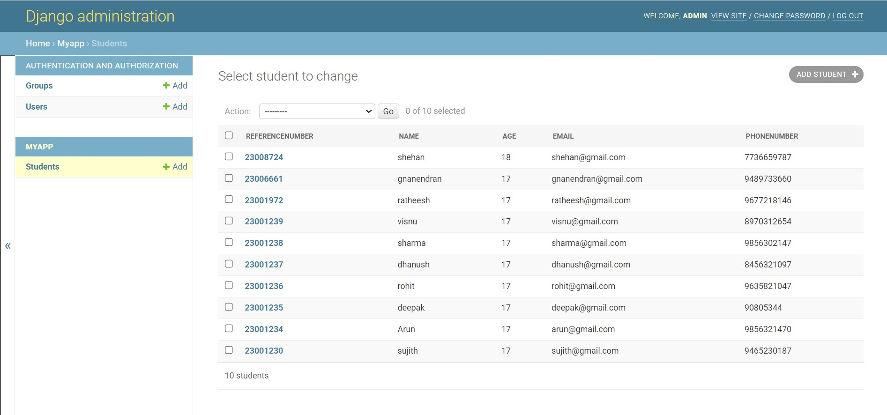
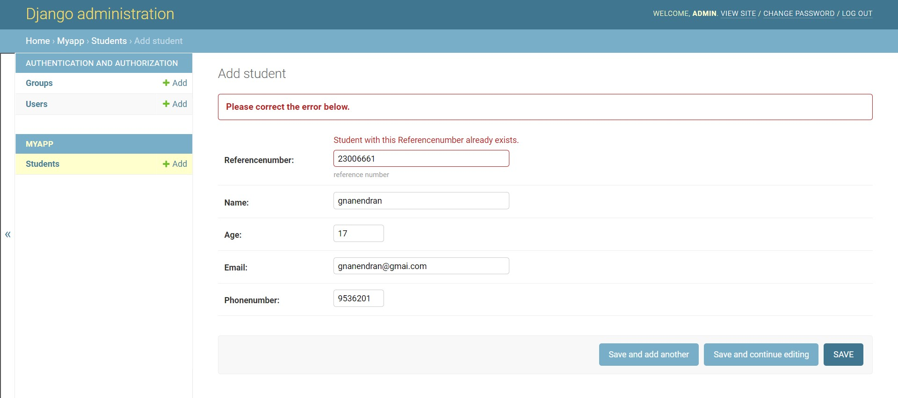

# Django ORM Web Application

## AIM
To develop a Django application to store and retrieve data from a database using Object Relational Mapping(ORM).

## Entity Relationship Diagram

Include your ER diagram here

## DESIGN STEPS

### STEP 1:
Create a folder called exe2 inside unit2 folder and go inside exe2  

### STEP 2:
Fork the repository https://github.com/<username>/django-orm-app in GitHub

### STEP 3:
clone the repository here inside the folder ex02

git clone https://github.com/<username>/django-orm-app

### STEP 4:
After cloning the folder with the repository name django-orm-appwill be created.

### STEP 5:
Now move into the django-orm-appfolder

cd django-orm-app

### STEP 6:
In this folder use necessary commands to create the django project folder commands using django-admin startproj myproj.

### STEP 7:
Then move into the folder myproj where manage.py file is located. Now give the commands python3 manage.py startapp myapp to create myapp. 

### STEP 8:
Then change the following in settings in the settings.py.

 ## STEP 8.1  
   In settings.py add import os in the line where we need to import libraries.

 ## STEP 8.2 
   Then add your url in ALLOWED_HOSTS =[

     ‘<your url>’
    ]

 ## STEP 8.3 
   Then add ‘myapp’ in the configuration INSTALLED_APPS. 

 ## STEP 8.4 
   Then add STATICFILES_DIRS=[
       os.path.join(BASE_DIR,'static')
    ] 

### STEP 9:
Check whether both settings.py and urls.py match

 ## STEP9.1
 Look at the list of installed apps in settings.py:
 
 INSTALLED_APPS = [
     'django.contrib.admin',
     …
 ]

 ## STEP9.2
   Now, look at the URL patterns in urls.py:
   
   urlpatterns = [
       path('admin/', admin.site.urls),
       …
   ]

### STEP 10:
To create admin account enter the following command to create a superuser:

python3 manage.py makemigrations

python3 manage.py migrate

python3 manage.py createsuperuser

### STEP 11:
Add the username and email for the superuser as follows.

Username (leave blank to use 'django'): admin

Email address: admin@example.com

Password:

Password (again):

You should see the following message on your screen:

Superuser created successfully.

### STEP 12:
Now visit the admin app at http://<<Thiea ide url>>:8000/admin 

And log in with the superuser account that you have created:

### STEP 13:
Now create models.py as follows:

from django.db import models
from django.contrib import admin

## Create your models here.
class Student (models.Model):
    referencenumber=models.CharField(max_length=20,help_text="reference number")
    name=models.CharField(max_length=100)
    age=models.IntegerField()
    email=models.EmailField()
    phonenumber=models.IntegerField()

class StudentAdmin(admin.ModelAdmin):
    list_display=('referencenumber','name','age','email','phonenumber)

### STEP 14:
Now create admins..py as follows:

from django.contrib import admin
from .models import Student,StudentAdmin,Employee,EmployeeAdmin

# Register your models here.

admin.site.register(Student,StudentAdmin)


### STEP 15:
After that create database as follows:

python3 manage.py makemigrations myapp
python3 manage.py migrate myapp

After these run the server and create 10 users


## PROGRAM

```
admin.py

from django.contrib import admin
from.models import student,studentAdmin
admin.site.register(student,studentAdmin)

models.py

from django.db import models
from django.contrib import admin
class student(models.Model):
    sid=models.CharField(max_length=200)
    name=models.CharField(max_length=100)
    salary=models.IntegerField()
    age=models.IntegerField()
    email=models.EmailField()

class studentAdmin(admin.ModelAdmin):
    list_display=('sid','name','salary','age','email')

```
## OUTPUT


### Primary Key Error


### ER DIAGRAM


## RESULT

